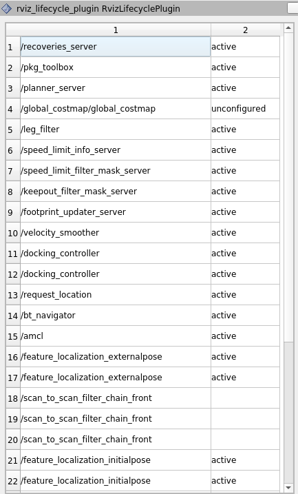

# ROS2 Lifecycle Monitoring

## Package Features:

- RVIZ plugin for monitoring statuses of lifecycle nodes
- Printing lifecycle node statuses to the console

## Future Features

- lifecycle nodes list must be updated when new lifecycle node appeared in the ROS network

## Current state
 
 